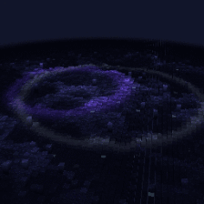

# 音域回响 / Sonic Topography



3D 音频响应地形可视化壁纸，基于 React + Three.js + GLSL 自定义着色器构建。将系统音频实时转化为起伏的柱状地形、扩散波纹和高空流星，为 Wallpaper Engine 打造沉浸式听觉视觉体验。

Wallpaper Engine 创意工坊页面：<https://steamcommunity.com/sharedfiles/filedetails/?id=3747222633>

## 特性

- 实时音频频谱分析（8 频段精细划分：subBass / bass / lowMid / mid / highMid / presence / brilliance / air）
- GLSL 自定义顶点+片元着色器，频段与空间区域一一对应
- 低频节拍触发波纹扩散，高频爆点触发流星坠落
- 16 种颜色主题 + 自动轮询
- 空闲状态自动过渡到环境波浪
- 逻辑帧与渲染帧分离，帧率无关的平滑算法
- Wallpaper Engine 媒体控制器集成（专辑封面、播放控制）

## 技术栈

| 层级 | 技术 |
|------|------|
| 渲染 | Three.js + React Three Fiber |
| 着色器 | GLSL（Simplex 噪声、FBM、缓动函数） |
| 音频 | Wallpaper Engine Audio API（128 bins 插值至 512） |
| 构建 | Vite + TypeScript |
| 平台 | Wallpaper Engine（Web 壁纸） |

## 快速开始

```powershell
# 安装依赖
pnpm install

# 开发模式
pnpm run dev

# 构建壁纸（产物在 dist-wallpaper/）
pnpm run build
```

### 导入 Wallpaper Engine

1. 运行 `pnpm run build` 构建项目
2. 打开 Wallpaper Engine -> 壁纸工作室 -> 创建壁纸
3. 选择"网页"类型，导入整个 `dist-wallpaper/` 目录
4. 在壁纸属性中勾选"音频反应"

## 频段响应映射

| 频段 | 频率范围 | 空间响应 | 动画特征 |
|------|----------|----------|----------|
| subBass | 0-258 Hz | 中心区域 | 大块整体抬升，带弹性过冲 |
| bass | 86-775 Hz | 中部环形 | 分块弹跳，基于噪声分布 |
| lowMid | 129-1507 Hz | 全地图 | 缓慢流动波浪 |
| mid | 154-2584 Hz | 全地图 | 河流状对角线流动 |
| highMid | 2627-4093 Hz | 边缘区域 | 随机散点尖刺 |
| presence | 4136-6249 Hz | 顶面 | 闪烁脉冲 |
| brilliance | 6290-9048 Hz | 边缘 | 微火花 |
| air | 9101-12925 Hz | 静止柱子顶面 | 星光闪烁 |

| 触发效果 | 触发频段 | 触发频率 |
|----------|----------|----------|
| 波纹 (Pulse) | 130-689 Hz | 低频节拍区 |
| 流星 (Meteor) | 6465-10342 Hz | 高频爆点区 |

## 项目结构

```
sonic-topography/
├── wallpaper/                    # Wallpaper Engine 专用源码
│   ├── index.html                # 壁纸 HTML 入口
│   ├── main.tsx                  # React 入口
│   ├── AppWallpaper.tsx          # 壁纸主组件
│   ├── project.json              # Wallpaper Engine 配置
│   └── preview.gif               # 预览图
│
├── src/
│   ├── components/AudioVisualizer/
│   │   ├── MapScene.tsx          # 3D 场景与实例化管理
│   │   └── CustomShaderMaterial.ts # 地形着色器
│   ├── lib/
│   │   ├── AudioEngine.ts        # 音频引擎与节拍检测
│   │   └── themes.ts             # 16 种颜色主题
│   └── types.ts                  # 类型定义
│
├── vite.wallpaper.config.ts      # Vite 构建配置
└── package.json
```

## 配置项

Wallpaper Engine 属性面板提供以下分组配置：

- **渲染** — 渲染精度（120x120 ~ 4096x4096）
- **外观** — 颜色主题、轮询间隔、强调色
- **音频响应** — 响应强度、响应范围
- **效果-波纹** — 启用、灵敏度、冷却
- **效果-流星** — 启用、灵敏度、冷却、点击触发
- **效果-空闲波浪** — 启用、防抖时间、过渡时长
- **视角** — 距离、角度、自动旋转
- **播放器** — 控制器显示、位置、尺寸

## 开源许可

本项目基于 [GPL-3.0](LICENSE) 协议开源。

## 致谢

- [Three.js](https://threejs.org/) — WebGL 渲染引擎
- [React Three Fiber](https://docs.pmnd.rs/react-three-fiber) — React 渲染器
- [Vite](https://vitejs.dev/) — 构建工具
- [Wallpaper Engine](https://www.wallpaperengine.io/) — 壁纸平台
